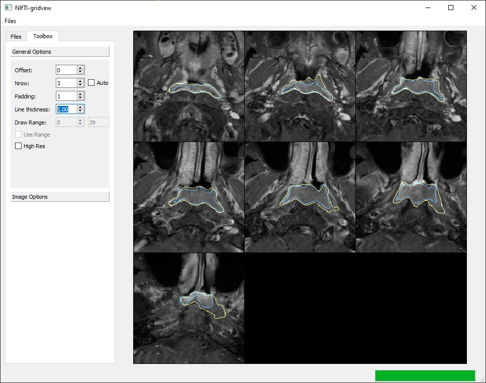

# NIfTI-gridview

Visualization of medical image is sometimes painful task for radiologist writing scientific papers. This
software aims to provide an easy and GUI way to do so.


## Prequisits

- SimpleITK
- PyQt5
- Pyside2
- cachetool

You can also chose to install from anaconda env:
```bash
conda env create -f NIfTi-Gridview.yml -n NIfTi-Gridview
```

## Preview



## Todo

- [ ] More documentations
- [x] Chache displayed data.
- [x] Save images to file.
- [ ] Allow specifying ID globbers with regex string.  
- [x] Allow tuning display window level.
- [ ] Allow changing display ROI, including W, H and position.
- [ ] Support multiple label classes in one label map.
- [ ] Removing loaded labels.
- [ ] Merge with torchio is desirable
- [ ] Save/Load scene.
